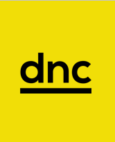

## Mini Projeto - Roof Imóveis DNC

## Descrição

- **Contextualização**
>Roof Imóveis é uma das maiores empresas do ramo imobiliário Brasileiro e quer expandir sua área de atuação fazendo um investimento internacional, com isso, ela contratou você, para uma consultoria estratégica. A empresa irá investir em imóveis no Condado de County, nos Estados Unidos. Utilizando o dataset disponibilizado, você irá aplicar os conceitos de CRISP-DM aprendidos até o momento em um projeto prático, que busca desenvolver seu pensamento analítico, insights e tomada de decisões.

- **King County - Condado de King - Washington**
>O Condado de King é um dos 39 condados do estado americano de Washington. A sede e cidade mais populosa do condado é Seattle.Foi fundado em 1852. Com mais de 2,2 milhões de habitantes, de acordo com o censo nacional de 2020, é o condado mais populoso do estado e o 12º mais populoso do país. 
>O Dataset apresenta a venda de imóveis e suas características na região de Maio de 2014 à Maio de 2015. Tem um total de 21613 registros com um total de 21 atributos. 

- [Dataset](https://www.kaggle.com/harlfoxem/housesalesprediction)
- [Dataset detalhado](https://geodacenter.github.io/data-and-lab/KingCounty-HouseSales2015/)

